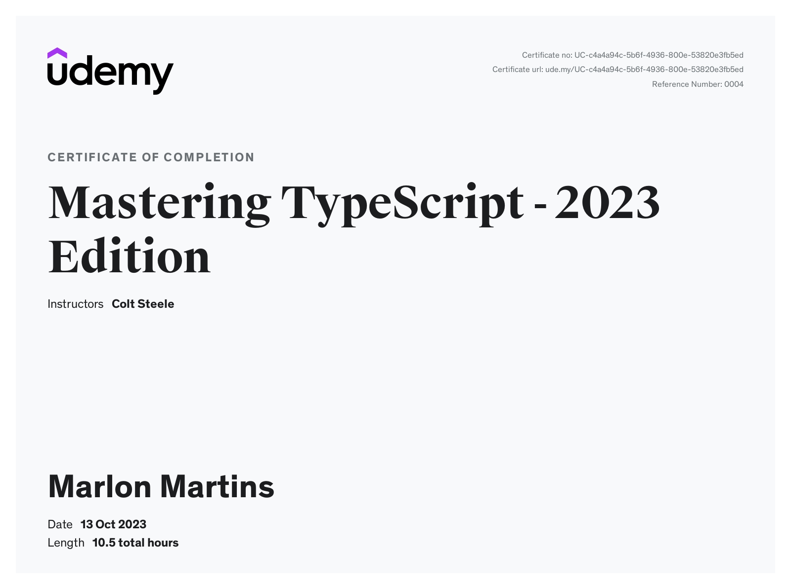

# Mastering TypeScript - 2023 Edition

Welcome to the GitHub repository for my project developed during the TypeScript course by Colt Steele on Udemy. In this course, I learned the essentials of TypeScript and applied the knowledge to build this repository.

## Course Certificate

I have successfully completed the [TypeScript course by Colt Steele on Udemy](https://www.udemy.com/course/learn-typescript/) and received the following certificate:

[View Certificate](certificate.pdf)

## Project Overview

TypeScript is a powerful superset of JavaScript that makes development smoother, safer, and helps you catch errors and avoid bugs early on. TypeScript adds a bunch of useful features to the JavaScript that you know and love. It helps you be a more productive developer and forces you to write better code.

This course covers all the syntax, features, and concepts you need to master TypeScript and start using it in your own codebases. We start with the very basics of the type system and cover everything up to incorporating TypeScript in React codebases and using Webpack with TypeScript.

Here’s a detailed breakdown of the topics the course covers:

* The TypeScript type system

* Union Types

* Intersection Types

* Tuples and Enums

* Interfaces

* The TypeScript compiler and how to configure it

* Working with the DOM and TypeScript

* TypeScript Classes

* Generics

* Type Narrowing

* Type Declarations

* Working with 3rd party libraries

* Webpack + TypeScript workflows

* Integrating React and TypeScript

* TypeScript’s Module System

---

Thank you for checking out my TypeScript project! If you have any questions or suggestions, please feel free to reach out.

